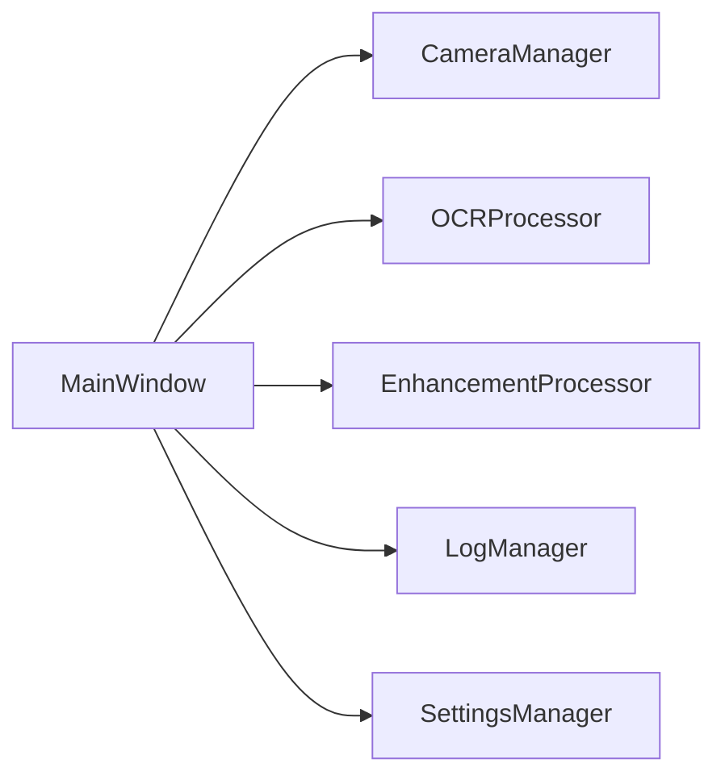
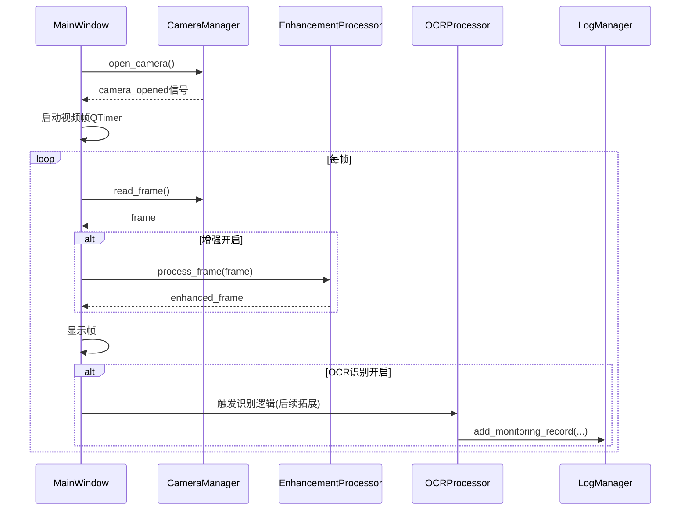
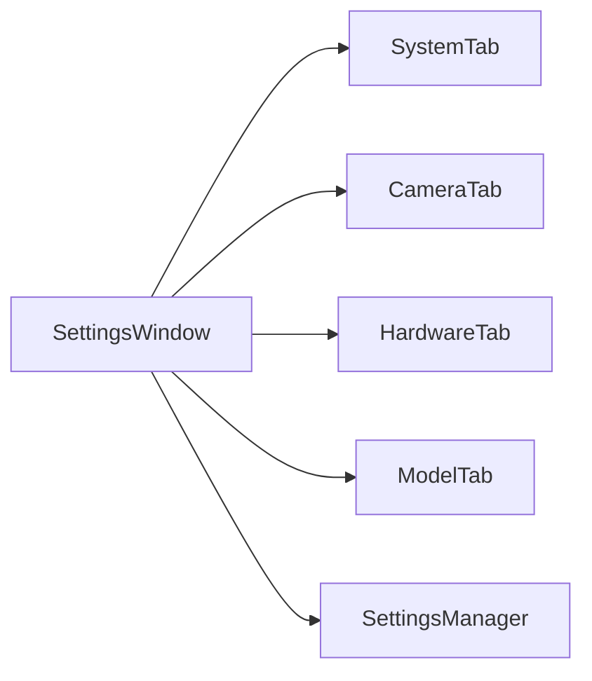

## 1 基于 PyQt 的界面集成管理

### 1.1 界面总体架构

系统基于 PyQt5 构建图形界面，采用单主窗体 + 多子界面的集成管理方式。主窗口 `MainWindow` 统一承载以下功能模块：

- 主监控界面（实时视频 + 右侧功能面板）
- 日志界面（监控记录、报警记录与预警阈值管理）
- 设置界面（系统信息、相机/硬件配置、模型配置）

主窗口采用 `QStackedWidget` 管理多个子界面，上方通过一个统一的顶部工具条实现界面切换、时间显示、用户登录/退出等功能。

界面结构示意如下：

```mermaid
flowchart TB
    mainWin[MainWindow]
    topBar[TopBar(界面切换+时间+用户)]
    stacked[QStackedWidget]
    mainPage[MainPage(实时监控)]
    logPage[LogWindow(日志管理)]
    settingsPage[SettingsWindow(设置)]

    mainWin --> topBar
    mainWin --> stacked
    stacked --> mainPage
    stacked --> logPage
    stacked --> settingsPage
```

### 1.2 主监控界面布局与功能划分

主监控界面采用左右分栏布局：

- **左侧区域**
  - 顶部信息栏：已抽取到主窗口统一管理。
  - 实时监控区：使用自定义 `AspectRatioLabel` 控件显示视频流，保持 16:9 宽高比，随窗口缩放自适应。
- **右侧功能面板**
  - 功能面板（`QGroupBox("功能面板")`）：
    - OCR 功能区：框选目标/区域、点击提示、全局搜索、开始/结束识别。
    - 增强功能区：启动增强、关闭增强。
  - 相机控制区：开启/关闭相机、变焦滑条及当前值显示。

各按钮通过槽函数与后端功能模块（相机管理、OCR 处理、增强处理等）解耦连接，主界面仅负责 UI 状态同步与交互逻辑，不直接承载算法代码。

### 1.3 日志界面与设置界面的集成

- 日志界面 `LogWindow` 通过标签页管理：
  - 监控记录（ID、识别值、识别文本、状态、备注）。
  - 报警记录（ID、报警时间、识别值、阈值上/下限、报警状态、备注）。
  - 报警阈值设置（ID、阈值上限、阈值下限、备注）。
- 设置界面 `SettingsWindow` 通过标签页管理：
  - 系统信息：版本、运行时间、日志/数据路径、磁盘占用等。
  - 相机设置：检测并选择相机、调整分辨率、亮度、饱和度等。
  - 硬件设备：报警灯类型、地址、端口、模式、闪烁频率，提供测试按钮。
  - 模型配置：从下拉菜单选择预配置的文字检测模型（如 PTDet、DBNet）、OCR 模型（通用/数码管/轻量）、增强模型（ECCE、Zero-DCE）以及增强强度（中/强）。

---

## 2 算法调取与监控程序逻辑实现

### 2.1 模块化功能管理

系统将算法调用与业务逻辑封装在独立的核心模块中，界面层通过信号槽调用这些模块，整体结构如下：



- `CameraManager`：负责相机打开/关闭、帧读取、分辨率设置、变焦控制等。
- `OCRProcessor`：负责 OCR 流程控制（开始/结束识别、区域选择等），目前为预留接口。
- `EnhancementProcessor`：负责增强通道开关与帧增强处理流程。
- `LogManager`：负责监控记录与报警记录的逻辑管理。
- `SettingsManager`：负责系统配置（相机/硬件/模型/路径等）的加载与保存。

### 2.2 实时监控与算法调用流程

实时监控流程如下：

1. 用户在主界面点击“开启相机”：
   - `MainWindow.on_open_camera()` 调用 `CameraManager.open_camera(camera_id)` 打开指定相机。
   - 成功后开启 `QTimer`，周期性调用 `update_video_frame()`。
2. `update_video_frame()` 中：
   - 调用 `CameraManager.read_frame()` 获取最新帧。
   - 若增强功能开启，则调用 `EnhancementProcessor.process_frame(frame)` 对帧进行增强。
   - 将处理后的帧转换为 `QImage/QPixmap` 显示在 `AspectRatioLabel` 中，并保持宽高比。
3. 当用户点击“开始识别”：
   - 界面调用 `OCRProcessor.start_recognition()`，进入“识别中”状态。
   - 实际 OCR 算法可在后续版本中在定时帧回调中插入，对当前帧或指定区域执行 OCR，并将结果通过 `LogManager.add_monitoring_record()` 记录。

整体时序可概括为：



---

## 3 基于 MySQL 的日志记录与报警管理（设计方案）

当前实现中，`LogManager` 使用内存列表保存监控记录与报警记录，接口设计已经与存储方式解耦。后续可将底层存储无缝替换为 MySQL。

### 3.1 日志与报警逻辑

`LogManager` 提供如下核心数据结构与方法：

- `MonitoringRecord`：
  - 字段：`id`、`timestamp`、`area_name`、`ocr_value`、`ocr_text`、`status`（normal/warning/alarm）、`threshold_min`、`threshold_max`、`remark`。
- `AlarmRecord`：
  - 字段：`id`、`timestamp`、`area_name`、`ocr_value`、`threshold_min`、`threshold_max`、`alarm_type`（above_max/below_min）、`processed`、`processed_time`、`remark`。
- `ThresholdConfig`：
  - 字段：`id`（作为区域/配置标识）、`min_value`、`max_value`、`enabled`、`remark`、时间戳等。

核心逻辑：

- `add_monitoring_record()`：
  1. 接收某区域的 OCR 数值结果。
  2. 根据 `ThresholdConfig` 中对应 ID 的上下限判断：
     - 超上限或低于下限 → 标记为 `alarm`，调用 `_trigger_alarm()` 生成报警记录。
     - 接近阈值 → 标记为 `warning`。
     - 否则为 `normal`。
  3. 将记录添加至监控记录集合，并发出 `record_added` 信号。

- `_trigger_alarm()`：
  - 构造 `AlarmRecord`，发出 `alarm_triggered` 信号；界面层在 `LogWindow` 中即时刷新报警列表并弹出报警提示。

### 3.2 向 MySQL 迁移的表结构设计

可在 MySQL 中设计如下三张核心表：

- `monitoring_record`（监控记录表）
  - `id` (PK, varchar) – 与程序中的 `MonitoringRecord.id` 对应  
  - `timestamp` (datetime)  
  - `area_name` (varchar)  
  - `ocr_value` (double)  
  - `ocr_text` (text)  
  - `status` (enum: normal/warning/alarm)  
  - `threshold_min` (double, nullable)  
  - `threshold_max` (double, nullable)  
  - `remark` (varchar)

- `alarm_record`（报警记录表）
  - `id` (PK, varchar)  
  - `timestamp` (datetime)  
  - `area_name` (varchar)  
  - `ocr_value` (double)  
  - `threshold_min` (double)  
  - `threshold_max` (double)  
  - `alarm_type` (enum: above_max/below_min)  
  - `processed` (bool)  
  - `processed_time` (datetime, nullable)  
  - `remark` (varchar)

- `threshold_config`（预警阈值配置表）
  - `id` (PK, varchar)  
  - `min_value` (double)  
  - `max_value` (double)  
  - `enabled` (bool)  
  - `remark` (varchar)  
  - `created_time` / `updated_time` (datetime)

将 `LogManager` 当前基于列表的实现替换为 MySQL 时，只需在 `add_monitoring_record`、`query_monitoring_records`、`add_threshold_config` 等方法中将列表操作替换为 SQL 操作，同时保持方法签名不变即可，UI 与上层逻辑无需调整。

---

## 4 设置界面和预警机制设置

### 4.1 设置界面总体结构

设置界面 `SettingsWindow` 通过 `QTabWidget` 管理以下标签页：

- 系统信息
- 相机设置
- 硬件设备
- 模型配置

数据来源于 `SettingsManager`，并通过 `config.json` 持久化保存。



### 4.2 预警机制与阈值配置

预警机制主要由两部分组成：

1. **阈值配置界面（在日志窗口的“报警设置”标签页中）**
   - 由唯一 ID 标识每个预警配置（同时作为区域标识）。
   - 为每个 ID 设置上下限（`min_value` / `max_value`）和备注。
   - 列表中展示：ID、阈值上限、阈值下限、备注。
   - 支持添加、修改、删除与清空输入框。
   - 双击列表行可将记录反填到输入区域，便于编辑。

2. **预警逻辑（在 `LogManager` 中）**
   - 根据监控记录的区域标识（可与配置 ID 对齐），查找对应阈值配置：
     - 如果未配置阈值，记录为 `normal`。
     - 如果配置存在且启用：
       - 数值 > 上限 → 触发“超出上限”报警。
       - 数值 < 下限 → 触发“低于下限”报警。
       - 靠近阈值 → 标记为 `warning`。
   - 日志界面中通过不同底色区分正常/预警/报警记录。

### 4.3 设置界面与预警机制的协同

- 设置界面负责提供**全局参数**：相机、硬件、模型、路径等系统级配置。
- 日志界面负责提供**局部阈值**：针对不同监控 ID/区域的上下限配置。
- 后端 `SettingsManager + LogManager` 将两者统一在配置层与逻辑层，使系统既具备全局行为控制又具备细粒度预警能力。


